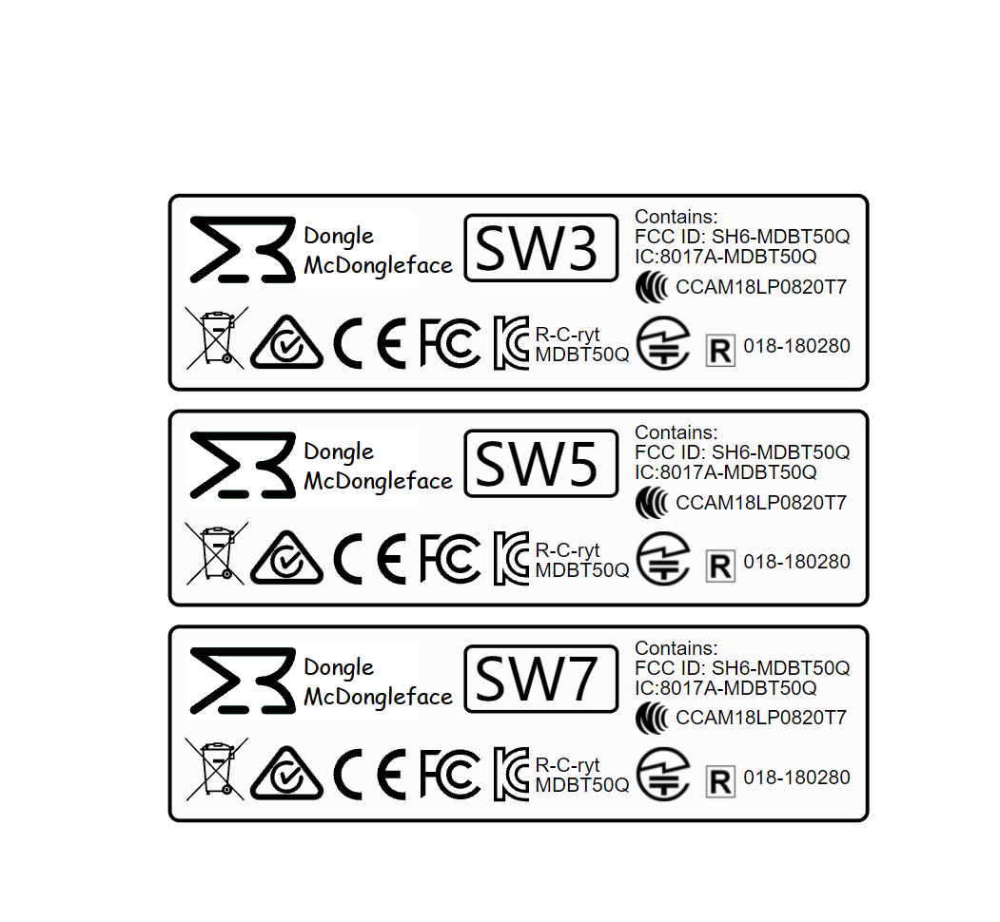

# Super Wireless Dongle Complaince Information

| **Country / Region**     | **Model: Tundra Tracker** |
| ------------------------ | ------------------------- |
| Australia                | TBD                       |
| Canada                   | IC: 8017A-MDBT50Q         |
| Japan                    | R 018-180280              |
| Taiwan                   | NCC CCAM18LP0820T7        |
| South Korea              | R-C-ryt MDBT50Q      |
| United States of America | FCC ID: SH6-MDBT50Q       |

