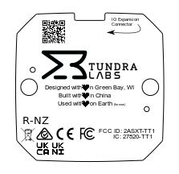

# Tundra Tracker Compliance Information

Tundra Tracker has compliance certification for the following regions: Australia, New Zealand, European Union (CE), United Kingdom, United States (FCC), Canada (ICED), Japan (TELEC), South Korea

| Country / Region         | Model: Tundra Tracker |
| ------------------------ | --------------------- |
| Canada                   | IC: 27520-TT1         |
| Japan                    | TBD                   |
| South Korea              | TBD                   |
| United States of America | FCC ID: 2ASXT         |

## **FCC - Regulatory Notices**

 Changes or modifications not expressly approved by the party responsible for compliance could void the user’s authority to operate the equipment. 

This device complies with part 15 of the FCC Rules. 

Operation is subject to the following two conditions: 

1. This device may not cause harmful interference. 
2. This device must accept any interference received, including interference that may cause undesired operation.

### Permitted Antenna 

This radio transmitter has been approved by the FCC to operate with the antenna types listed below with the maximum permissible gain indicated. Antenna types not included in this list, having a gain greater than the maximum gain indicated for that type, are strictly prohibited for use with this device.

| Frequency Range    | Type              | Max Gain |
| ------------------ | ----------------- | -------- |
| 2400MHz to 2500MHz | PCB Patch Antenna | 2.5dBi   |

### RF exposure safety 

#### SAR required 

This device complies with the FCC RF exposure limits and has been evaluated in compliance with portable exposure condition. 

The exposure standard for wireless mobile phones employs a unit of measurement known as the Specific Absorption Rate, or SAR. 

This device has been shown to be capable of compliance for localized SAR for uncontrolled environment/general population exposure limits specified in ANSI/IEEE Std. C95.1-1992 and has been tested in accordance with the measurement procedures specified in FCC RF Exposure guidelines and IEEE Std. 1528-2013. 

The standards include a substantial safety margin designed to assure the safety of all persons, regardless of age and health. The standard incorporates a substantial margin of safety to give additional protection for the public and to account for any variations. 

####  Distance 

There is no limitation as to which distance can be used from the human body.

### Class B device notice 

Note: This equipment has been tested and found to comply with the limits for a Class B digital device, pursuant to part 15 of the FCC Rules. These limits are designed to provide reasonable protection against harmful interference in a residential installation. This equipment generates, uses and can radiate radio frequency energy and, if not installed and used in accordance with the instructions, may cause harmful interference to radio communications. However, there is no guarantee that interference will not occur in a particular installation. If this equipment does cause harmful interference to radio or television reception, which can be determined by turning the equipment off and on, the user is encouraged to try to correct the interference by one or more of the following measures:

- Reorient or relocate the receiving antenna.
-  Increase the separation between the equipment and receiver. 
- Connect the equipment into an outlet on a circuit different from that to which the receiver is connected.
- Consult the dealer or an experienced radio/TV technician for help.

## ISED - Regulatory Notices

Changes or modifications not expressly approved by the party responsible for compliance could void the user’s authority to operate the equipment. 

This device complies with ISED license-exempt RSS(s). 

Operation is subject to the following two conditions: 

1. This device may not cause harmful interference. 
2. This device must accept any interference received, including interference that may cause undesired operation.

### Permitted Antenna 

This radio transmitter has been approved by the ISED to operate with the antenna types listed below with the maximum permissible gain indicated. Antenna types not included in this list, having a gain greater than the maximum gain indicated for that type, are strictly prohibited for use with this device.

| Frequency Range    | Type              | Max Gain |
| ------------------ | ----------------- | -------- |
| 2400MHz to 2500MHz | PCB Patch Antenna | 2.5dBi   |

### RF exposure safety 

#### SAR required 

This device complies with the ISED RF exposure limits and has been evaluated in compliance with portable exposure condition. 

The exposure standard for wireless mobile phones employs a unit of measurement known as the Specific Absorption Rate, or SAR. 

This device has been shown to be capable of compliance for localized SAR for uncontrolled environment/general population exposure limits specified in ANSI/IEEE Std. C95.1-1992 and has been tested in accordance with the measurement procedures specified in ISED RSS-102 and IEEE Std. 1528-2013. 

The standards include a substantial safety margin designed to assure the safety of all persons, regardless of age and health. The standard incorporates a substantial margin of safety to give additional protection for the public and to account for any variations.

####  Distance 

There is no limitation as to which distance can be used from the human body.

### CAN ICES-003 (B) 

This Class B digital apparatus complies with Canadian ICES-003.

