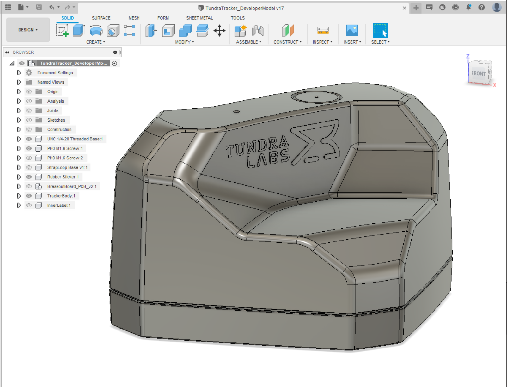

# Tundra Tracker 3D Model

In order to fully leverage the expandability of Tundra Tracker, an accurate 3D model can be [downloaded here]( https://github.com/tundra-labs/tundra-tracker-docs/raw/master/docs/files/TundraTracker_DeveloperModel%20v17.zip ).

For electircal button input and haptic output expansion, the breakout board in the 3D model can be purchased <a href="https://tundra-labs.com/products/tundra-tracker-io-expansion-board" target="_blank">here</a>.

We encourage customers to develop and share new and novel baseplate designs and other accessories.  Please do share your work and customizations on the [Tundra Labs Forum]( forum.tundra-labs.com).  Happy Hacking!

