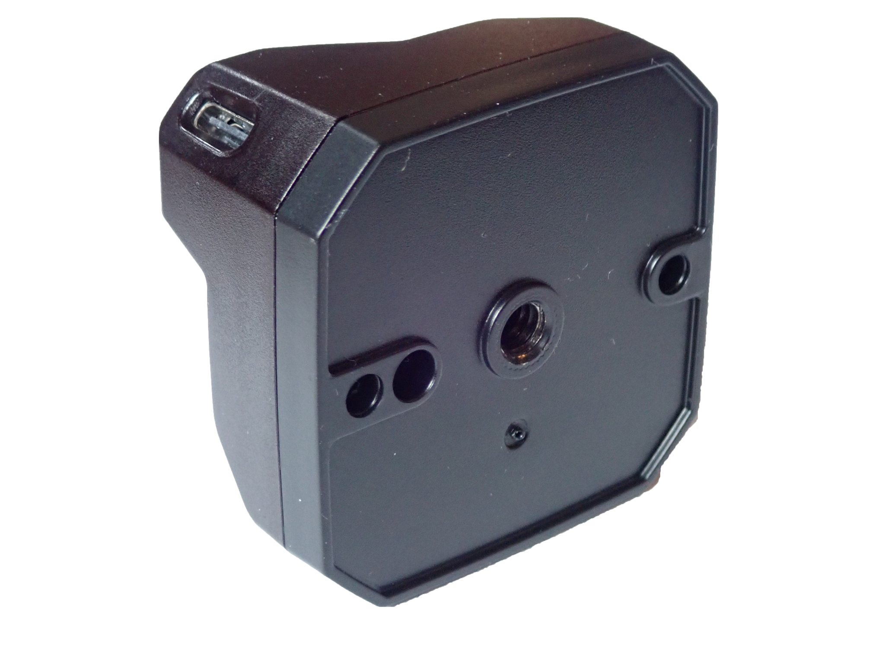
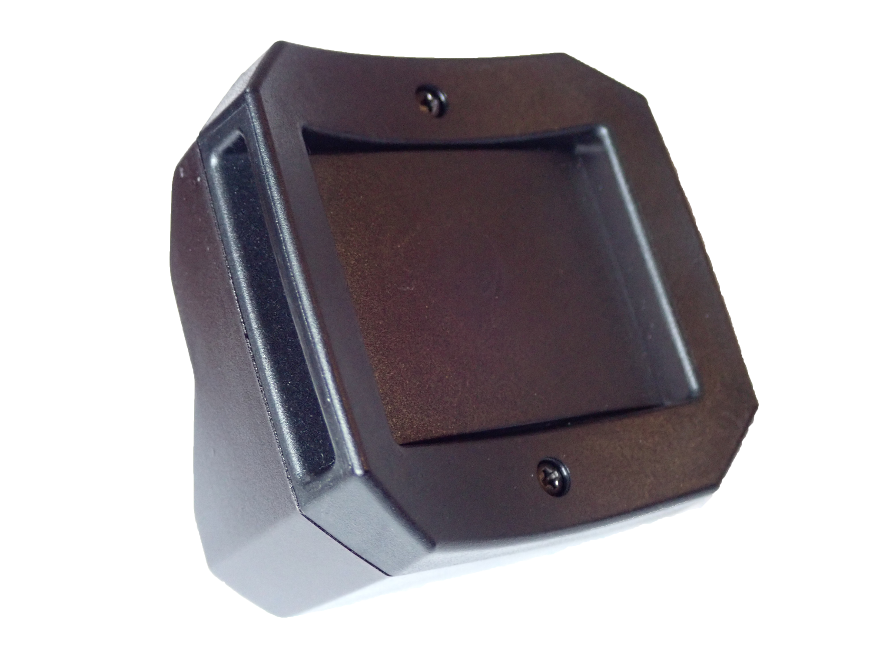

# Tracker Hardware Specifications

#### Sensors

Tundra Tracker has 18 sensors as shown in the picture. Please avoid covering any of the sensors during use.

#### Where to place your label or sticker

If you want to affix your label or sticker on a tracker, please use the blue area in the picture, avoiding sensors inside.

#### Base Plates

Tundra Tracker has two types of base plates. 

- Base plate with ¼ inch female screw for camera mount and a hole for stabilizing pin:

- Base plate with strap loop (less than 1inch width):

#### How to charge a tracker

Please connect a USB-C cable to a tracker, and the other side to your PC or USB wall charger.

#### LED status

- Blue: Power on, but not paired
- Blue (blinking): Pairing mode
- Green: Paired / Fully Charged
- Yellow/Orange: Charging
- Red: Battery is less than 5%

#### Battery Life

Tundra Tracker’s battery will last for 9 hours on average.

#### Supported Dongles

- Super Wireless Dongle (SW3/SW5/SW7) by Tundra Labs
- Dongle for VIVE Tracker, VIVE Tracker (2018) and VIVE Tracker 3.0
- Dongle inside headset of HTC VIVE series and Valve Index

#### Supported BaseStation

- BaseStaion1.0 by HTC
- BaseStaion2.0 by Valve

